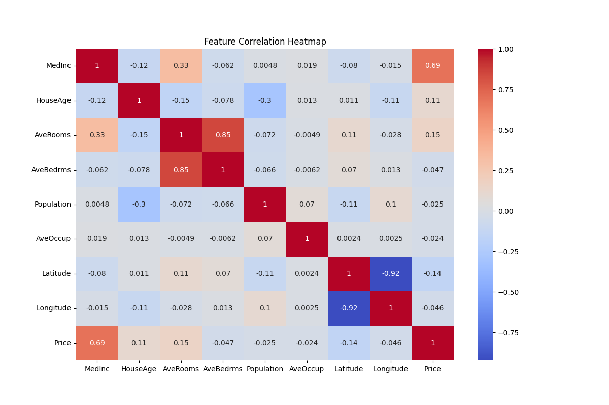
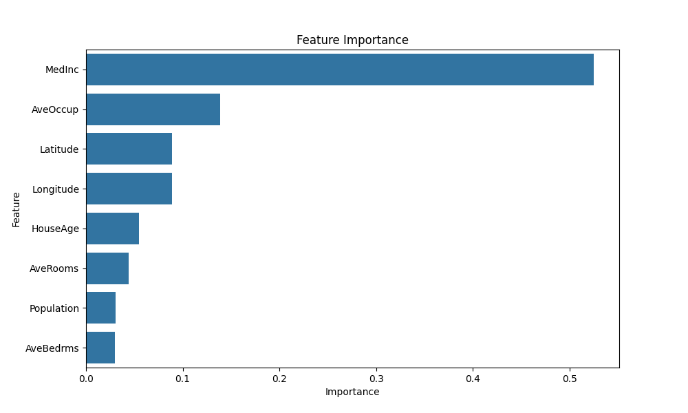
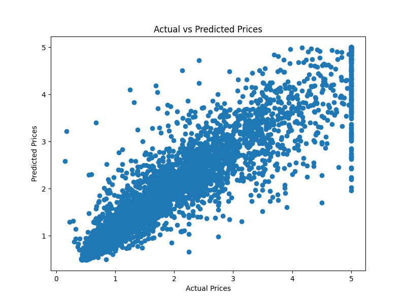

# House Price Prediction using Machine Learning

## Overview

This project is an end-to-end Machine Learning application that predicts house prices using regression algorithms. The project uses the California Housing Dataset and implements complete ML workflow including data preprocessing, visualization, model training, evaluation, and deployment using Streamlit.

The objective of this project is to analyze housing-related features and accurately predict house prices based on input parameters such as median income, house age, average rooms, population, and location.

---

# Features

* Data preprocessing and cleaning
* Exploratory Data Analysis (EDA)
* Correlation heatmap visualization
* Feature importance analysis
* Linear Regression implementation
* Random Forest Regression implementation
* Model comparison using evaluation metrics
* Model saving using Joblib
* Streamlit web application for real-time prediction

---

# Technologies Used

* Python
* Pandas
* NumPy
* Matplotlib
* Seaborn
* Scikit-learn
* Streamlit
* Joblib

---

# Machine Learning Workflow

1. Dataset Loading
2. Data Cleaning and Exploration
3. Feature Selection
4. Train-Test Split
5. Feature Scaling
6. Model Training
7. Model Evaluation
8. Prediction Generation
9. Model Deployment

---

# Models Used

## 1. Linear Regression

A basic regression algorithm used for predicting continuous numerical values.

## 2. Random Forest Regressor

An ensemble learning algorithm that improves prediction accuracy by combining multiple decision trees.

---

# Evaluation Metrics

The following evaluation metrics were used:

* RMSE (Root Mean Squared Error)
* MAE (Mean Absolute Error)
* R² Score

Random Forest Regression achieved better performance compared to Linear Regression.

---

# Project Structure

house-price-prediction-ml/

│── app.py
│── main.py
│── requirements.txt
│── README.md
│── housing.csv
│── correlation_heatmap.png
│── feature_importance.png
│── prediction_plot.png
│── .gitignore

---

# Output Screenshots

## Correlation Heatmap

## Feature Importance

## Prediction Plot

---

# Installation

Clone the repository:

git clone YOUR_GITHUB_REPOSITORY_LINK

Move into project folder:

cd house-price-prediction-ml

Install required libraries:

pip install -r requirements.txt

---

# Run the Project

Train the Machine Learning models:

python main.py

Run the Streamlit web application:

streamlit run app.py

---

# Streamlit Web Application

The Streamlit application allows users to input housing-related features and get real-time predicted house prices using the trained Random Forest model.

---

# Future Improvements

* XGBoost Integration
* Hyperparameter Tuning
* Flask API Deployment
* Docker Deployment
* Cloud Hosting
* Advanced Feature Engineering

---

# Git Ignore

Create a `.gitignore` file and add:

*.pkl
**pycache**/

This prevents large model files from being uploaded to GitHub.

---

# Author

Aryan Singh

---

# Conclusion 

This project demonstrates the complete Machine Learning workflow from data preprocessing to deployment. It helped in understanding regression models, feature engineering, evaluation metrics, and deployment of ML models using Streamlit.
